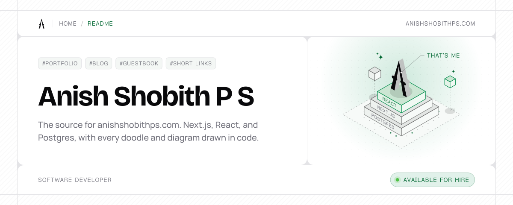
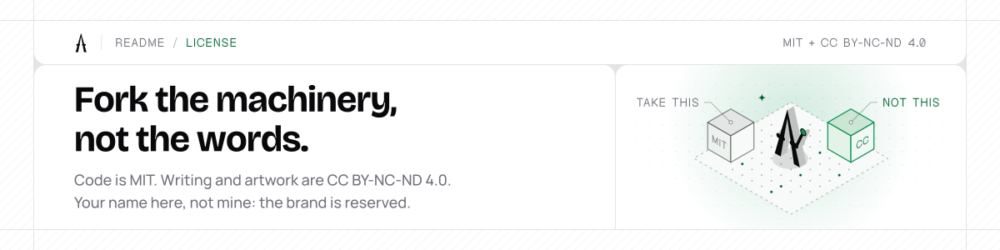

<p align="center">
  <picture>
    <source media="(prefers-color-scheme: dark)" srcset=".github/banner-dark.svg"/>
    
  </picture>
</p>

<p align="center">
  <a href="https://anishshobithps.com">Live site</a> /
  <a href="https://anishshobithps.com/blogs">Blog</a> /
  <a href="https://anishshobithps.com/feed.xml">RSS</a> /
  <a href="https://anishshobithps.com/branding">Branding</a> /
  <a href="https://anishshobithps.com/privacy-policy">Privacy</a>
</p>

Source code for [anishshobithps.com](https://anishshobithps.com): a portfolio, blog, and guestbook. Interfaces, bots, and questionable automation scripts, mostly so I don't have to repeat myself.

<div align="center">

[](https://github.com/anishshobithps/anishshobithps.com/stargazers) [](https://github.com/anishshobithps/anishshobithps.com/network/members) [](https://github.com/anishshobithps/anishshobithps.com/commits)

[](LICENSE.md)

       

</div>

> ### License at a glance
>
> - **Functional code**, including the code examples in this README and in blog posts: MIT
> - **Writing, original artwork, and creative copy**, including this README's prose: CC BY-NC-ND 4.0
> - **Logo, wordmark, and mascot:** CC BY-NC-ND 4.0 as artwork, not licensed as branding
> - **Name, domain, likeness, photograph, and brand identity:** reserved
> - **Third-party material:** its original license
>
> This repository is intentionally mixed-license, and so is this README. See [`LICENSE.md`](LICENSE.md) for the exact scope.

---

## What's in here

| Route                        | What it does                                                                                                        |
| ---------------------------- | ------------------------------------------------------------------------------------------------------------------- |
| `/`                          | Hero with doodles, project teasers, latest post, guestbook rotator                                                  |
| `/blogs`, `/blog/*`          | MDX posts via [fumadocs](https://fumadocs.dev), isometric covers, reading time, anonymous reactions, view counts, threaded comments |
| `/projects`                  | Pulled from the database, not a hardcoded array; ordered and toggled from the admin                                 |
| `/resume`                    | PDF rendered inline with react-pdf, streamed from the latest GitHub release; `/api/resume/download` saves it         |
| `/guestbook`                 | Clerk-authenticated messages with likes, pinning, and soft delete                                                    |
| `/photos`                    | Photo gallery with the EXIF each shot was taken at. Dev only for now, see [Photos](#photos)                          |
| `/branding`                  | Type scale, logo downloads (SVG or PNG, 16 to 512 px), the doodle set, and a live OG preview                         |
| `/privacy-policy`            | What gets stored, where, and why                                                                                     |
| `/admin/*`                   | Owner-only dashboard for comments, guestbook, links, projects, and photos (dev only)                                 |
| `/og`                        | Generated OpenGraph cards with the isometric mascot ([takumi](https://github.com/kane50613/takumi), not Satori)      |
| `/feed.xml`                  | RSS 2.0 feed of every post, linked from page metadata for autodiscovery                                              |
| `/llms.txt`                  | Machine-readable site summary; every post also serves raw MDX at `/blog/<slug>.mdx`                                  |
| `/sitemap.xml`, `/robots.txt`| The sitemap is built from the post source, so new posts show up without touching it                                  |
| `/<slug>`                    | Short-link resolver with click counts, see [Short links](#short-links)                                              |

On every page:

- <kbd>⌘</kbd> <kbd>K</kbd> (or <kbd>Ctrl</kbd> <kbd>K</kbd>) opens a command palette for navigation, theme switching, the resume, and socials. <kbd>⇧</kbd> <kbd>⌘</kbd> <kbd>D</kbd> flips the theme without opening anything.
- A floating quick menu, fronted by the logo mascot. On a post it shows reading progress and jumps to the comments; on `/resume` it downloads the PDF; on the blog and guestbook it holds the sign-in pass. Drag it anywhere and it remembers the spot.
- The footer shows what I'm listening to on Spotify, refreshed every minute through the server.

A few things worth calling out:

- Reactions and view counts are anonymous, no account needed. Identity is a SHA-256 of `ip:IP_HASH_SALT` (see [`src/lib/ip.ts`](src/lib/ip.ts)), giving one row per post per hash. The raw IP is never stored.
- Comments and the guestbook need Clerk. Deleting your Clerk account cleans up your rows via the webhook below.
- Projects, links, and engagement all live in Postgres, and posts live in `content/blog`. Nothing is hardcoded that shouldn't be.
- The artwork is authored directly in code rather than imported as raster exports. The isometric scenes, blog covers, doodles, mascot, and OG card are SVG drawn in TSX, coloured from the same CSS tokens as the rest of the UI, and they respect `prefers-reduced-motion`. See [The art](#the-art).

---

## Running locally

Node 22+ and pnpm 11 (the repo pins `packageManager`, so `corepack enable` is enough).

```bash
pnpm install
pnpm db:migrate         # applies the committed migrations in drizzle/
pnpm dev                # http://localhost:3000
```

You'll need a few things first:

| What       | Where                                                     |
| ---------- | --------------------------------------------------------- |
| PostgreSQL | [neon.tech](https://neon.tech) (free tier works)          |
| Auth       | [clerk.com](https://clerk.com) (for guestbook & comments) |
| Spotify    | run `pnpm spotify:token` once                             |

Create `.env.local` at the root:

```env
DATABASE_URL=postgresql://...
IP_HASH_SALT=some-random-secret        # required — any long random string; keep it secret

SPOTIFY_CLIENT_ID=
SPOTIFY_CLIENT_SECRET=
SPOTIFY_REFRESH_TOKEN=

NEXT_PUBLIC_CLERK_PUBLISHABLE_KEY=pk_...
CLERK_SECRET_KEY=sk_...
OWNER_CLERK_USER_ID=user_...           # your user ID = admin powers
CLERK_WEBHOOK_SECRET=whsec_...         # Clerk > Webhooks > Signing Secret

NEXT_PUBLIC_BASE_URL=https://anishshobithps.com
NEXT_PUBLIC_UMAMI_WEBSITE_ID=...       # optional, or remove from layout.tsx
GITHUB_TOKEN=ghp_...                   # optional — only lifts the API rate limit on repo cards
SHORTLINK_DOMAIN=                      # optional — a second domain that only serves short links

R2_ACCOUNT_ID=                         # optional — photos only, see the Photos section
R2_ACCESS_KEY_ID=
R2_SECRET_ACCESS_KEY=
R2_ORIGINALS_BUCKET=                   # private: untouched originals
R2_PUBLIC_BUCKET=                      # public: resized web copies
R2_PUBLIC_URL=https://photos.example.com
```

Only `DATABASE_URL` and `IP_HASH_SALT` are truly required to boot. `IP_HASH_SALT` throws loudly if missing rather than silently hashing with nothing. `NEXT_PUBLIC_BASE_URL` falls back to the Vercel production URL, then `http://localhost:3000`.

Clerk webhook: point `https://yourdomain.com/api/webhooks/clerk` at `user.deleted` to keep the DB clean when users delete their accounts.

Spotify token: `pnpm spotify:token` prints the authorize URL to open, then swaps the code it gives back for a refresh token. Register `http://127.0.0.1:3000` as a redirect URI in the Spotify dashboard first, or the exchange fails.

---

## Project layout

```
content/blog/          MDX posts — the only place posts live
drizzle/               committed SQL migrations + meta
scripts/               one-off tsx scripts (seeding, Spotify token)
tests/                 vitest, node environment, pure logic only
.github/               CI workflow and the README artwork
src/
  proxy.ts             Clerk middleware + short-link domain routing
  app/(site)/          public pages
  app/admin/           owner-only dashboard
  app/api/             resume proxy + Clerk webhook
  app/[...link]/       short-link resolver (catch-all, keep it last)
  app/og/              OpenGraph image route
  components/
    diagrams/          isometric engine (iso.tsx) and every scene drawn with it
    shared/            header, footer, quick menu, command palette, doodles, logo + mascot, OG card
    engagement/        comment and guestbook panels
    layouts/           page, blog, and hero shells
    ui/                shadcn primitives
  hooks/               client hooks (draggable, engagement anchor, …)
  lib/                 db, schema, and everything not React
```

---

## Commands

```bash
pnpm dev          # dev server — http://localhost:3000
pnpm build        # next build
pnpm start        # production server
pnpm types:check  # fumadocs codegen + next typegen + tsc --noEmit
pnpm lint         # ESLint
pnpm test         # Vitest
pnpm test:watch   # Vitest, watching
pnpm knip         # unused code/dependency check

pnpm db:migrate   # apply committed migrations
pnpm db:push      # push schema directly (dev only — skips migrations)
pnpm db:studio    # Drizzle Studio
pnpm db:seed:guestbook          # seed fake guestbook entries
pnpm db:seed:guestbook:cleanup  # remove seeded entries
pnpm db:seed:links              # seed short links
```

CI ([`.github/workflows/ci.yml`](.github/workflows/ci.yml)) runs `types:check` and `test` on every push to `main` and every PR, with a read-only token. Lint and knip are local-only for now.

---

## Writing a post

Drop an `.mdx` file in `content/blog/`. The filename is the slug. Frontmatter is validated by [`source.config.ts`](source.config.ts):

```yaml
---
title: The Hidden Architecture of Emoji
description: One or two sentences. Also used for the OG image, the RSS feed, and the meta description.
date: 2026-03-19
tags:
  - Unicode
  - Typography
lastModified: 2026-04-02   # optional — set it by hand when an edit is worth announcing
---
```

`lastModified` is deliberately manual. It used to come from git history, but shallow clones on the deploy host re-dated every post on every push. Reading time is computed at build time by a remark plugin.

`<TypographyMark>` and `<TypographyMuted>` are available in every post without an import. Video goes through the media player in `src/components/ui/media-player.tsx`, imported at the top of the post.

Every post gets an isometric cover. Give it a bespoke scene by adding the slug to `covers` in [`src/components/diagrams/blog-covers.tsx`](src/components/diagrams/blog-covers.tsx); anything without one gets a block cover generated from the slug.

---

## Admin

`/admin` is gated on `OWNER_CLERK_USER_ID` matching the signed-in Clerk user. There's no role system, just the one ID. It gives you stats, comment and guestbook moderation (pin, soft delete), project CRUD with ordering, short-link management, and a button to bust the cached resume PDF.

---

## Short links

Any unclaimed path resolves through `/[...link]`, in one of two shapes:

```
/<slug>          →  tag = "" (the default bucket)
/<tag>/<slug>    →  namespaced, e.g. /talk/react-india
```

Slugs are unique per `(tag, slug)`. Each link can redirect straight through (permanent or temporary), or, if it has a title, description, or OG image, render an interstitial with preview metadata first, which is the point when you're posting into something that unfurls links. Clicks are counted in `after()` so the redirect isn't waiting on the write, and only the count is stored.

Set `SHORTLINK_DOMAIN` to serve the same links from a second, shorter domain pointed at this deployment. [`src/proxy.ts`](src/proxy.ts) lets slugs through on that host and sends anything that belongs to the main site (`/blog`, `/admin`, `/api`, …) to the main domain with a 308. The list of main-site paths lives in [`src/lib/reserved-segments.ts`](src/lib/reserved-segments.ts), so add new top-level routes there too.

---

## Photos

`/photos` is built but switched off in production. `src/lib/features.ts` turns it on for `next dev` only, and while it's off the page, its admin screen, the nav entry, the sitemap entry, and the privacy-policy section for R2 all disappear. Flipping that flag is the launch.

It exists because Cloudinary's free tier caps uploads at 10 MB, and a straight-off-the-phone HEIC or a DSLR JPEG blows past that. So photos skip Cloudinary and the server entirely:

1. The admin page reads the file in the browser. It sniffs the real format from the bytes, pulls EXIF with [exifr](https://github.com/MikeKovarik/exifr), and renders four web copies (480 to 2400 px wide, WebP where the browser can encode it, JPEG otherwise) plus a 16 px blur placeholder. HEIC decodes natively in Safari; other browsers lazy-load [heic-to](https://github.com/hoppergee/heic-to) (libheif, LGPL-3.0) only when they need it.
2. A server action checks everything with zod, writes a row with status `uploading`, and hands back presigned PUT URLs. `Content-Length` and `Content-Type` are part of the signature, so R2 rejects anything other than the exact file the server approved.
3. The browser uploads straight to R2, with progress, retries, and cancel. Nothing passes through Vercel, so its 4.5 MB request limit never comes into it. Originals can be up to 200 MB.
4. A second action `HEAD`s every object and checks the original's size before flipping the row to `draft`. A failed or cancelled upload deletes whatever did land.

Originals go into a **private** bucket byte for byte, EXIF and GPS included, and you can download them from the admin. The public bucket only ever holds the resized copies, which are re-encoded from a canvas and carry no metadata at all. GPS is never read into the database. A photo needs alt text before it can be published.

On the page, rows are justified with plain flexbox (each tile grows by its aspect ratio), so there's no layout JavaScript and no shift. `?photo=<id>` opens the viewer, which makes every photo a shareable link with its own OpenGraph image. Arrow keys and swipes move between photos, and dates show in the time zone the photo was taken in.

### Setting it up

1. In Cloudflare R2, create two buckets, one for originals and one for web copies. Give only the web-copies bucket public access, through a custom domain for production or the `r2.dev` URL for testing, and put that URL in `R2_PUBLIC_URL`.
2. Create an R2 API token with **Object Read & Write** on both buckets, and fill in the `R2_*` variables above.
3. Add this CORS policy to **both** buckets, with your real origins:

   ```json
   [
     {
       "AllowedOrigins": ["http://localhost:3000", "https://anishshobithps.com"],
       "AllowedMethods": ["PUT"],
       "AllowedHeaders": ["content-type", "cache-control"],
       "MaxAgeSeconds": 3600
     }
   ]
   ```

4. Run `pnpm db:migrate` to create the `photos` table (`drizzle/0012_photos.sql`).
5. Open `/admin/photos`, drop some files in, add alt text, and publish.

If a variable is missing, the admin page lists which ones instead of showing the uploader.

No CSP or `next.config.mjs` change is needed. The gallery uses plain `` tags with a precomputed `srcset` rather than the Next image optimizer, and the CSP already allows HTTPS for `img-src` and `connect-src`.

---

## The art

None of the illustrations are image exports. They're all drawn in code:

| Piece                         | Where                                                                                     |
| ----------------------------- | ----------------------------------------------------------------------------------------- |
| Isometric engine              | [`src/components/diagrams/iso.tsx`](src/components/diagrams/iso.tsx): projector, boxes, plates, labels, lifts |
| Page scenes and blog covers   | `page-art.tsx`, `blog-covers.tsx`, `git-chaos.tsx`, `layers.tsx` in the same folder         |
| Doodles and nudges            | [`src/components/shared/doodles.tsx`](src/components/shared/doodles.tsx)                    |
| Logo and mascot               | `logo.tsx`, `logo-icon.tsx`, `logo-mascot.tsx` in `src/components/shared/`                  |
| OpenGraph card                | [`src/components/shared/OG.tsx`](src/components/shared/OG.tsx), rendered by `/og`           |

Colours come from the tokens in [`src/app/global.css`](src/app/global.css). The OG route runs on the server, where CSS variables don't exist, so [`src/lib/theme-tokens.ts`](src/lib/theme-tokens.ts) resolves `var()` and `color-mix()` from that file into hex. The README artwork in `.github/` is built the same way, with its text converted to outlines so it renders identically on GitHub in both themes.

The engine is MIT. The expressive artwork produced with it, meaning the scenes, doodles, mascot, and card design, is CC BY-NC-ND 4.0. See [License](#license).

---

## Deploy

<div align="center">

[](https://vercel.com) [](https://neon.tech) [](https://clerk.com) [](https://developer.spotify.com) [](https://cloudinary.com) [](https://umami.is)

</div>

Add the env vars and point `DATABASE_URL` at Neon. The build runs `next build` only. It never migrates, so run `pnpm db:migrate` against the production database yourself when the schema changes.

Three things that bite on a fresh deploy:

- CSP in [`next.config.mjs`](next.config.mjs) hardcodes `clerk.anishshobithps.com`, so point that at your own Clerk frontend domain.
- Any new remote image host needs adding to both `images.remotePatterns` and the CSP.
- If you use `SHORTLINK_DOMAIN`, add that domain to the same Vercel project, or the proxy never sees its requests.

---

## Forking

Fork the machinery, not the words. A fork can keep, modify, and redistribute the MIT code. It can't publish modified versions of the CC BY-NC-ND writing and art, and it can't use my name, logo, or mascot as its own branding. If a fork keeps any of that writing or art unmodified, CC BY-NC-ND 4.0 still applies to it; forking doesn't turn it into MIT. Before a fork goes live:

- [ ] Delete `content/blog/` and write your own posts
- [ ] Update [`src/lib/config.ts`](src/lib/config.ts): name, domain, email, socials, repo, resume URL, `availableForHire`
- [ ] Replace the logo and mascot (`logo.tsx`, `logo-icon.tsx`, `logo-mascot.tsx`) and `public/favicon-*.svg`
- [ ] Replace or remove the doodles, page scenes, blog covers, and the OG card design. The isometric engine stays, so draw your own
- [ ] Change the fallback name, domain, and role in [`src/app/og/route.tsx`](src/app/og/route.tsx)
- [ ] Remove `public/profile.avif` and the README artwork in `.github/` (`banner-*.svg`, `license-*.svg`)
- [ ] Check the license of `public/fonts/LastoriaBoldRegular.otf` (the signature font) before shipping it
- [ ] Write your own privacy policy in `src/app/(site)/privacy-policy/page.tsx`; this one describes my setup
- [ ] Point the CSP, Clerk domain, and redirects in [`next.config.mjs`](next.config.mjs) at your own

---

## License

<p align="center">
  <picture>
    <source media="(prefers-color-scheme: dark)" srcset=".github/license-dark.svg"/>
    
  </picture>
</p>

Code is [MIT](LICENSE.md), including the code blocks in this README and in blog posts. The prose and artwork (including artwork drawn in code) are [CC BY-NC-ND 4.0](LICENSE.md). Some brand assets, like the logo and mascot, are also covered by that copyright license, but their use as a name, logo, identity, or endorsement is not licensed. [`LICENSE.md`](LICENSE.md) spells out where the line falls, how to attribute, and what a fork may keep. None of it licenses my name, likeness, or brand identity for use as your own.
